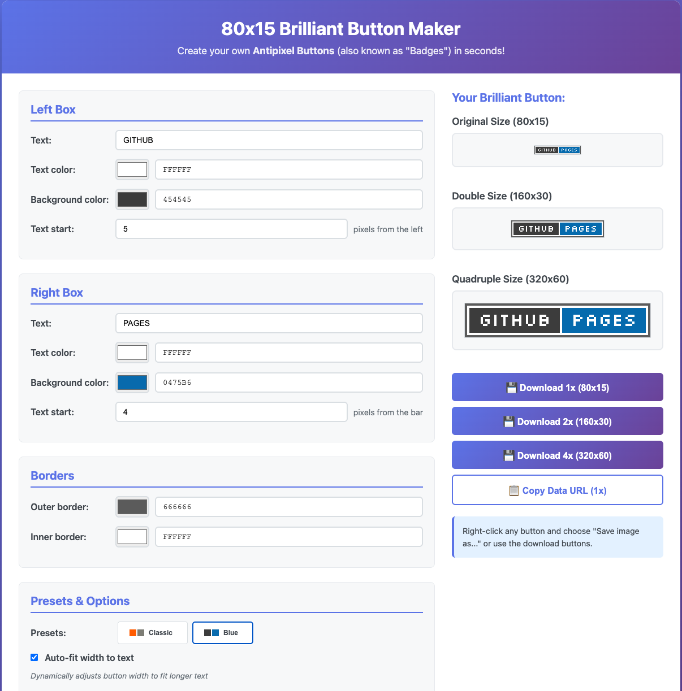

# 80x15 Brilliant Button Maker

A modern, client-side implementation of the classic "Brilliant Button Maker" for creating 80x15 pixel buttons (also known as "Antipixel Buttons" or "Badges").

## Overview

This tool generates customizable 80x15 pixel buttons entirely in the browser using HTML5 Canvas. No server-side processing required!

Based on:
- Original Brilliant Button Maker by Luca Zappa ([original site](https://hob.syndamia.com/brilliant-button-maker/))
- Bill Zeller's PHP button generation script
- [Trovami Button Maker](https://trovami.altervista.org/en/webmasters/makebutton)

## Screenshot




## Features

- **Real-time preview** - See changes instantly as you type
- **Full customization**:
  - Left and right text
  - Text colors
  - Background colors
  - Border colors (outer and inner)
  - Text positioning
  - Divider bar position
- **Export options**:
  - Download as PNG
  - Copy as Data URL for embedding
- **Modern UI** with color pickers and hex input fields
- **No dependencies** - Pure HTML/CSS/JavaScript
- **Works offline** - No server required

## Usage

### Running Locally

1. Open `index.html` in a web browser, or
2. Run a local server:
   ```bash
   python3 -m http.server 8000
   ```
   Then visit http://localhost:8000

### Creating a Button

1. Enter text for the left and right sections
2. Choose colors using the color pickers or hex inputs
3. Adjust positioning as needed
4. Click "Download Button" to save as PNG

## Files

- `index.html` - Main application interface
- `style.css` - Styling and layout
- `button-maker.js` - Canvas rendering logic
- `button.txt` - Original PHP implementation by Bill Zeller
- `class-BrilliantButton.phps` - PHP class wrapper by Luca Zappa

## Technical Details

### Canvas Rendering

The button is drawn using HTML5 Canvas API:
1. Outer border (1px stroke)
2. Inner border (1px stroke)
3. Vertical divider bar
4. Left section fill
5. Right section fill
6. Text rendering (left and right)

### Color Format

Colors are stored as hex values (e.g., `#ff6600`) and synchronized between color pickers and text inputs.

## Examples

Common button styles:
- RSS/VALID - `#ff6600` / `#898e79`
- CSS/VALID - `#005599` / `#00aa00`
- XHTML/1.1 - `#cc0000` / `#666666`

## License

This project is licensed under the GNU General Public License v3.0 - see the [LICENSE](LICENSE) file for details.

- Original PHP code by Bill Zeller: "Steal this code"
- PHP class by Luca Zappa: GNU GPL v2

## Credits

- Luca Zappa - Original Brilliant Button Maker
- Bill Zeller - [PHP button generation script](https://web.archive.org/web/20080623232547/http://www.cowpimp.com/ButtonMaker/button.txt)
- [Silkscreen](https://kottke.org/plus/type/silkscreen/) font character mapping

## References

Generator references:
- https://hob.syndamia.com/brilliant-button-maker/
- http://www.acasystems.com/en/button-maker/

# Button Examples
- https://web.badges.world/
- https://microbuttons.wordpress.com/
